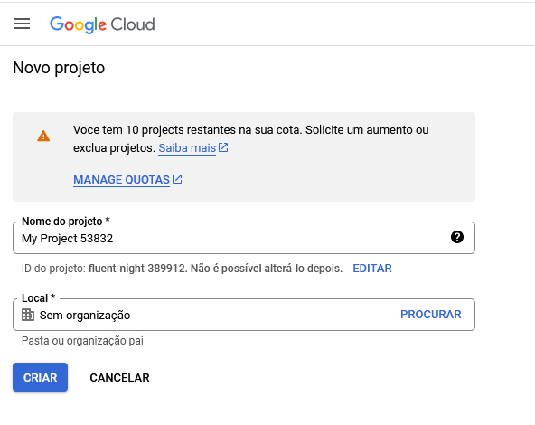
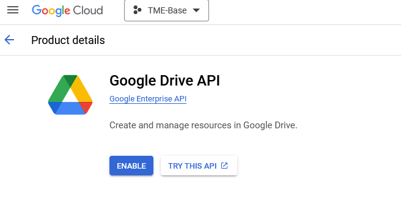

- Create a Google Cloud project for your Google Workspace app, extension, or integration.
    - With a logged google account, go to https://console.cloud.google.com/projectcreate and create a project, like shown below:
    
- Enable the APIs you want to use in your Google Cloud project.
    - Go to https://console.cloud.google.com/workspace-api/products and click on the google drive API and then click on the Enable button:
    
    
- Configure OAuth consent to ensure users can understand and approve what access your app has to their data.
    - Go to https://console.cloud.google.com/apis/credentials/consent and add a OAuth consent permission by filling the form
    - After that go to OAuth consent screen menu on the left side and add test users (must be google clients)
    
- Create access credentials to authenticate your app's end users or service accounts.
    - Go to https://console.cloud.google.com/apis/credentials and create a new credential and save it as credentials.json
    
    
    
- Run pip install -r requiriments.txt
- The query is passed by Input, so run the script and Enter the desired query. The files that match will be show on terminal